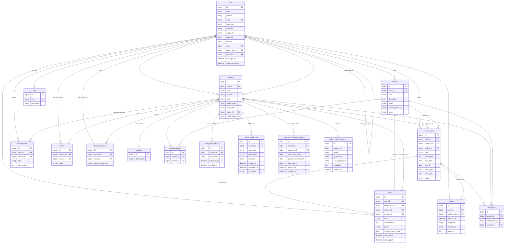

# ProContact — Database Structure

> Last updated: 2026-04-26 — covers schema through migration `2026_04_26_130004_create_client_portal_access_log_table`.
>
> **For draw.io users:** this document ships in three import-ready formats so you can render the ER diagram in seconds:
> 1. **Mermaid `erDiagram`** — paste into *draw.io → Arrange → Insert → Advanced → Mermaid*.
> 2. **DBML** — paste into [dbdiagram.io](https://dbdiagram.io), export as PNG/PDF/SVG.
> 3. **CSV (entities + relationships)** — paste into *draw.io → Arrange → Insert → Advanced → CSV* for a fully editable shape-based diagram.

---

## 1. High-level Architecture

ProContact is a **multi-tenant SaaS** — every entrepreneur (User with role `admin`) owns isolated business data. All major domain tables carry a `user_id` column that is the tenant key; the application scopes every query to `Auth::id()`.

| Domain | Tables | Purpose |
|---|---|---|
| **Identity & access** | `users`, `roles`, `password_reset_tokens`, `sessions` | Authentication + RBAC for entrepreneurs and authenticated client users. |
| **Core CRM** | `contacts`, `activites`, `contact_activite`, `emails`, `numero_telephones`, `statuses`, `rendez_vous`, `notes`, `note_templates`, `rappels`, `statistiques` | Domain data owned per entrepreneur. |
| **Client portal (passwordless)** | `client_portal_tokens`, `client_portal_otps`, `client_portal_trusted_devices`, `client_portal_access_log` | OTP-verified, GDPR-compliant magic-link access for clients. |
| **Infrastructure** | `migrations`, `cache`, `cache_locks`, `jobs`, `job_batches`, `failed_jobs` | Laravel framework tables. |

---

## 2. ER Diagram (Mermaid — drop into draw.io)

> In draw.io: **Arrange → Insert → Advanced → Mermaid**, paste, **Insert**.



---

## 3. DBML (paste into dbdiagram.io)

```dbml
Project ProContact {
  database_type: 'PostgreSQL'
  Note: 'Multi-tenant CRM with passwordless client portal.'
}

Table users {
  id bigint [pk, increment]
  nom varchar [not null]
  prenom varchar [not null]
  email varchar [unique, not null]
  telephone varchar
  rue varchar
  numero_rue varchar
  ville varchar
  code_postal varchar
  pays varchar
  email_verified_at datetime
  password varchar [not null]
  remember_token varchar
  last_login_at datetime
  password_reset_token varchar
  password_reset_expires datetime
  google_id varchar
  apple_id varchar
  provider varchar
  avatar varchar
  admin_user_id bigint [ref: > users.id]
  role_id bigint [not null, ref: > roles.id]
  contact_id bigint [ref: > contacts.id]
  created_at datetime
  updated_at datetime
}

Table roles {
  id bigint [pk, increment]
  nom varchar [unique, not null]
  description varchar
  created_at datetime
  updated_at datetime
}

Table statuses {
  id bigint [pk, increment]
  status_client varchar [not null]
  created_at datetime
  updated_at datetime
}

Table contacts {
  id bigint [pk, increment]
  user_id bigint [not null, ref: > users.id]
  nom varchar [not null]
  prenom varchar [not null]
  rue varchar
  numero varchar
  ville varchar
  code_postal varchar
  pays varchar
  state_client varchar
  status_id bigint [ref: > statuses.id]
  portal_token varchar [unique]
  created_at datetime
  updated_at datetime

  Indexes {
    user_id
    status_id
  }
}

Table activites {
  id bigint [pk, increment]
  user_id bigint [not null, ref: > users.id]
  nom varchar [not null]
  description text
  numero_telephone varchar
  email varchar
  image varchar
  created_at datetime
  updated_at datetime
}

Table contact_activite {
  id bigint [pk, increment]
  contact_id bigint [not null, ref: > contacts.id]
  activite_id bigint [not null, ref: > activites.id]
  created_at datetime
  updated_at datetime

  Indexes {
    (contact_id, activite_id) [unique]
  }
}

Table emails {
  id bigint [pk, increment]
  contact_id bigint [not null, ref: > contacts.id]
  user_id bigint [ref: > users.id]
  email varchar [not null]
  created_at datetime
  updated_at datetime
}

Table numero_telephones {
  id bigint [pk, increment]
  contact_id bigint [not null, ref: > contacts.id]
  user_id bigint [ref: > users.id]
  numero_telephone varchar [not null]
  created_at datetime
  updated_at datetime
}

Table rendez_vous {
  id bigint [pk, increment]
  user_id bigint [not null, ref: > users.id]
  contact_id bigint [not null, ref: > contacts.id]
  activite_id bigint [not null, ref: > activites.id]
  titre varchar [not null]
  description text
  date_debut date [not null]
  date_fin date [not null]
  heure_debut time [not null]
  heure_fin time [not null]
  statut varchar [not null, default: 'scheduled', note: 'scheduled | confirmed | completed | cancelled | no_show']
  created_at datetime
  updated_at datetime

  Indexes {
    user_id
    contact_id
    activite_id
    date_debut
  }
}

Table notes {
  id bigint [pk, increment]
  user_id bigint [not null, ref: > users.id]
  rendez_vous_id bigint [ref: > rendez_vous.id]
  activite_id bigint [ref: > activites.id]
  contact_id bigint [ref: > contacts.id, note: 'Set when authored from client portal']
  titre varchar [not null]
  commentaire text [not null]
  priorite varchar [not null, default: 'Normale', note: 'Basse | Normale | Haute | Urgente']
  is_shared_with_client boolean [not null, default: false]
  date_create datetime
  date_update datetime
  created_at datetime
  updated_at datetime
}

Table note_templates {
  id bigint [pk, increment]
  user_id bigint [not null, ref: > users.id]
  contact_id bigint [ref: > contacts.id, note: 'NULL = entrepreneur template; set = client-personal template']
  titre varchar [not null]
  commentaire text [not null]
  created_at datetime
  updated_at datetime

  Indexes {
    (user_id, contact_id)
  }
}

Table rappels {
  id bigint [pk, increment]
  user_id bigint [not null, ref: > users.id]
  rendez_vous_id bigint [not null, ref: > rendez_vous.id]
  date_rappel datetime [not null]
  frequence varchar [not null]
  destinataire varchar [not null, default: 'Les deux', note: 'Moi | Le client | Les deux']
  emails_cc text
  created_at datetime
  updated_at datetime
}

Table statistiques {
  id bigint [pk, increment]
  activite_id bigint [not null, ref: > activites.id]
  rendez_vous_id bigint [not null, ref: > rendez_vous.id]
  contact_id bigint [not null, ref: > contacts.id]
  created_at datetime
  updated_at datetime
}

Table client_portal_tokens {
  id uuid [pk]
  contact_id bigint [not null, ref: > contacts.id]
  token_hash varchar [unique, not null, note: 'SHA-256 of raw token; raw never stored']
  last_used_at datetime
  revoked_at datetime
  created_at datetime
  updated_at datetime
}

Table client_portal_otps {
  id uuid [pk]
  contact_id bigint [not null, ref: > contacts.id]
  code_hash varchar [not null, note: 'bcrypt of 6-digit code']
  email_hash varchar [not null, note: 'SHA-256 of submitted email']
  attempts tinyint [not null, default: 0]
  expires_at datetime [not null]
  consumed_at datetime
  ip_address varchar
  created_at datetime
  updated_at datetime
}

Table client_portal_trusted_devices {
  id uuid [pk]
  contact_id bigint [not null, ref: > contacts.id]
  cookie_hash varchar [unique, not null]
  user_agent_hash varchar
  ip_address_first_seen varchar
  last_used_at datetime [not null]
  expires_at datetime [not null]
  revoked_at datetime
  created_at datetime
  updated_at datetime
}

Table client_portal_access_log {
  id bigint [pk, increment]
  contact_id bigint [ref: > contacts.id, note: 'set null on cascade after erasure']
  event varchar [not null, note: 'token_visit | otp_sent | otp_failed | otp_success | trusted_device_used | access_revoked | erasure_requested | access_lockout']
  ip_address varchar
  user_agent_hash varchar
  metadata json
  created_at datetime [default: `CURRENT_TIMESTAMP`]
}
```

---

## 4. CSV for draw.io entity import

> In draw.io: **Arrange → Insert → Advanced → CSV…**, paste this block, **Import**.
> Each row becomes a labelled rectangle; `refs` builds the arrows.

```csv
# label: %name%<br><i style="font-size:10px;color:#666">%domain%</i>
# style: rounded=0;whiteSpace=wrap;html=1;fillColor=%fill%;strokeColor=#333;fontSize=12;
# namespace: csvimport-
# connect: {"from":"refs", "to":"name", "invert":false, "style":"endArrow=ERmany;startArrow=ERone;endFill=0;html=1;"}
# width: auto
# height: auto
# padding: -8
# ignore: refs,fill,domain
# nodespacing: 40
# levelspacing: 80
# edgespacing: 40
# layout: horizontalflow
name,domain,fill,refs
users,identity,#dbeafe,roles
roles,identity,#dbeafe,
sessions,identity,#dbeafe,users
password_reset_tokens,identity,#dbeafe,
contacts,crm,#fef3c7,users|statuses
statuses,crm,#fef3c7,
activites,crm,#fef3c7,users
contact_activite,crm,#fef3c7,contacts|activites
emails,crm,#fef3c7,contacts|users
numero_telephones,crm,#fef3c7,contacts|users
rendez_vous,crm,#fef3c7,users|contacts|activites
notes,crm,#fef3c7,users|rendez_vous|activites|contacts
note_templates,crm,#fef3c7,users|contacts
rappels,crm,#fef3c7,users|rendez_vous
statistiques,crm,#fef3c7,activites|rendez_vous|contacts
client_portal_tokens,portal,#dcfce7,contacts
client_portal_otps,portal,#dcfce7,contacts
client_portal_trusted_devices,portal,#dcfce7,contacts
client_portal_access_log,portal,#dcfce7,contacts
```

---

## 5. Tables — full reference

### 5.1 Identity & access

#### `users`

The entrepreneur or authenticated client. Role-driven access via `role_id`.

| Column | Type | Null | Notes |
|---|---|---|---|
| `id` | bigint | NO | **PK** |
| `nom` | varchar | NO | Last name |
| `prenom` | varchar | NO | First name |
| `email` | varchar | NO | **UNIQUE** |
| `telephone` | varchar | YES | |
| `rue`, `numero_rue`, `ville`, `code_postal`, `pays` | varchar | YES | Address fields |
| `email_verified_at` | datetime | YES | |
| `password` | varchar | NO | bcrypt |
| `remember_token` | varchar | YES | |
| `last_login_at` | datetime | YES | |
| `password_reset_token`, `password_reset_expires` | varchar/datetime | YES | Custom flow |
| `google_id`, `apple_id`, `provider`, `avatar` | varchar | YES | Social auth |
| `admin_user_id` | bigint | YES | **FK → users.id** (clients link to the entrepreneur who owns them) |
| `role_id` | bigint | NO | **FK → roles.id** (`restrict`) |
| `contact_id` | bigint | YES | **FK → contacts.id** (`set null`) — linked Contact for client users |
| `created_at`, `updated_at` | datetime | YES | |

#### `roles`

| Column | Type | Notes |
|---|---|---|
| `id` | bigint | **PK** |
| `nom` | varchar | **UNIQUE** — `admin` or `client` |
| `description` | varchar | |

#### `password_reset_tokens`, `sessions` — Laravel defaults.

---

### 5.2 Core CRM

#### `contacts`

The independent's clients (and prospects).

| Column | Type | Notes |
|---|---|---|
| `id` | bigint | **PK** |
| `user_id` | bigint | **FK → users.id** (`cascade`) — tenant key |
| `nom`, `prenom` | varchar | required |
| `rue`, `numero`, `ville`, `code_postal`, `pays` | varchar | optional |
| `state_client` | varchar | Free-text status label |
| `status_id` | bigint | **FK → statuses.id** (`set null`) |
| `portal_token` | varchar | **UNIQUE** — magic-link claim token (also stored hashed in `client_portal_tokens.token_hash`) |

#### `activites`

A service the entrepreneur offers (e.g., piano lessons).

| Column | Type | Notes |
|---|---|---|
| `id` | bigint | **PK** |
| `user_id` | bigint | **FK → users.id** |
| `nom` | varchar | |
| `description` | text | |
| `email`, `numero_telephone`, `image` | varchar | |

#### `contact_activite` (pivot)

Many-to-many between contacts and activities. **UNIQUE (contact_id, activite_id)**.

#### `statuses`

Reference list (e.g., "Prospect", "Client", "Inactif").

#### `emails`, `numero_telephones`

One-to-many child tables — a contact can have multiple. `user_id` is denormalized for fast tenant filtering.

#### `rendez_vous`

An appointment between an entrepreneur, a contact, and an activity.

| Column | Type | Notes |
|---|---|---|
| `id` | bigint | **PK** |
| `user_id`, `contact_id`, `activite_id` | bigint | **FKs** (all `cascade`) |
| `titre`, `description` | string/text | |
| `date_debut`, `date_fin` | date | |
| `heure_debut`, `heure_fin` | time | |
| `statut` | varchar | `scheduled` (default) \| `confirmed` \| `completed` \| `cancelled` \| `no_show` |

Indexes: `user_id`, `contact_id`, `activite_id`, `date_debut`.

#### `notes`

A free-form note attached to an appointment / activity / contact.

| Column | Type | Notes |
|---|---|---|
| `id` | bigint | **PK** |
| `user_id` | bigint | **FK** — entrepreneur owner (always the appointment owner, even when authored by the client) |
| `rendez_vous_id` | bigint | **FK** (`cascade`) |
| `activite_id` | bigint | **FK** (`set null`) |
| `contact_id` | bigint | **FK** — set when authored from the client portal |
| `titre`, `commentaire` | text | |
| `priorite` | varchar | `Basse \| Normale \| Haute \| Urgente`, default `Normale` |
| `is_shared_with_client` | bool | false → admin only; true → visible in client portal |
| `date_create`, `date_update` | datetime | Domain timestamps (in addition to Laravel `created_at`/`updated_at`) |

#### `note_templates`

Reusable note bodies. Two kinds in the same table:
- **Entrepreneur templates** — `contact_id IS NULL`, available to the entrepreneur for all clients.
- **Client-personal templates** — `contact_id IS NOT NULL`, created by the client from the portal.

#### `rappels`

Email reminders for appointments.

| Column | Notes |
|---|---|
| `user_id`, `rendez_vous_id` | **FKs** |
| `date_rappel` | When to send |
| `frequence` | One-shot or recurring label |
| `destinataire` | `Moi \| Le client \| Les deux` (default `Les deux`) |
| `emails_cc` | Pipe-separated extra CC list (text) |

#### `statistiques`

Denormalized join table powering reports — every appointment writes one row linking activity + appointment + contact for fast aggregation.

---

### 5.3 Client portal (passwordless, GDPR-compliant)

All raw secrets are **hashed before storage**. Raw tokens / OTPs / cookies are never persisted.

#### `client_portal_tokens`

Long-lived magic-link tokens (one or more per contact). Used to identify which contact a portal URL belongs to. Possessing a valid token does **not** grant access on its own — see `client_portal_trusted_devices` and `client_portal_otps`.

| Column | Notes |
|---|---|
| `id` | UUID **PK** |
| `contact_id` | **FK → contacts.id** (`cascade`) |
| `token_hash` | **UNIQUE** — SHA-256 of the raw URL token |
| `last_used_at` | Updated on every successful resolve |
| `revoked_at` | Non-null = revoked (admin action or erasure) |

#### `client_portal_otps`

Short-lived 6-digit codes emailed to the contact's verified email.

| Column | Notes |
|---|---|
| `id` | UUID **PK** |
| `contact_id` | **FK** (`cascade`) |
| `code_hash` | bcrypt of the code |
| `email_hash` | SHA-256 of the submitted email — binds the OTP to that email |
| `attempts` | tinyint, capped at 5; OTP is invalidated on the 6th try |
| `expires_at` | 10 minutes after issue |
| `consumed_at` | Non-null = used (single-use enforced) |
| `ip_address` | For security audit |

Purged daily, 24h after expiry.

#### `client_portal_trusted_devices`

The "remember this browser" cookie. Issued only after successful OTP verification; rotated on every use; bound to a UA-hash to limit token theft impact.

| Column | Notes |
|---|---|
| `id` | UUID **PK** |
| `contact_id` | **FK** (`cascade`) |
| `cookie_hash` | **UNIQUE** — SHA-256 of the raw cookie |
| `user_agent_hash` | SHA-256 of the raw UA string |
| `ip_address_first_seen` | Set once at issuance |
| `last_used_at`, `expires_at`, `revoked_at` | Lifecycle |

Cookie attributes (HTTP layer): `HttpOnly; Secure (prod); SameSite=Lax; Path=/portal; Max-Age=60d`.

Purged 30 days after expiry.

#### `client_portal_access_log`

Append-only audit trail for every portal-related event. Required under GDPR Art. 32 (security of processing).

| Column | Notes |
|---|---|
| `id` | bigint **PK** |
| `contact_id` | **FK → contacts.id** (`set null` so logs survive contact erasure) |
| `event` | `token_visit`, `otp_sent`, `otp_failed`, `otp_success`, `otp_email_mismatch`, `otp_blocked_lockout`, `trusted_device_issued`, `trusted_device_used`, `trusted_device_revoked`, `trusted_device_ua_mismatch`, `access_lockout`, `access_revoked_by_admin`, `erasure_requested` |
| `ip_address` | Raw IP |
| `user_agent_hash` | Hashed (UA itself never stored) |
| `metadata` | JSON — extra context (admin user id, reason code, etc.) |
| `created_at` | DEFAULT `CURRENT_TIMESTAMP` |

Auto-purged after 12 months by `php artisan portal:purge` (scheduled daily at 03:00).

---

## 6. Relationship cheat-sheet

| Parent | Cardinality | Child | On delete |
|---|---|---|---|
| `users` | 1 → ∞ | `contacts`, `activites`, `rendez_vous`, `notes`, `note_templates`, `rappels`, `emails`, `numero_telephones` | cascade |
| `users` | 1 → ∞ | `users` (admin_user_id) | cascade |
| `roles` | 1 → ∞ | `users` | restrict |
| `contacts` | 1 → ∞ | `rendez_vous`, `emails`, `numero_telephones`, `notes`, `note_templates`, `client_portal_tokens`, `client_portal_otps`, `client_portal_trusted_devices`, `statistiques` | cascade |
| `contacts` | 1 → ∞ | `client_portal_access_log` | set null |
| `contacts` | 1 → 0..1 | `users` (contact_id) | set null |
| `statuses` | 1 → ∞ | `contacts` | set null |
| `activites` | 1 → ∞ | `rendez_vous`, `statistiques`, `contact_activite` | cascade |
| `activites` | 1 → ∞ | `notes` | set null |
| `rendez_vous` | 1 → ∞ | `notes`, `rappels`, `statistiques` | cascade |
| `contacts` ↔ `activites` | M:N | via `contact_activite` | |

---

## 7. Multi-tenant scoping

Every domain query in the app filters by `user_id = Auth::id()`. The exception is the **client portal**, which authenticates by `portal_token` → resolves a `Contact` → loads only that contact's data. Notes, appointments, and templates inherit tenant isolation through the contact's `user_id`.

`emails` and `numero_telephones` carry a denormalized `user_id` (nullable) so admin queries can filter without joining `contacts`.

---

## 8. Migration timeline

| Date | Migration | What changed |
|---|---|---|
| 2025-07-18 | `create_users_table`, `create_statuses_table`, `create_activites_table`, `create_contacts_table`, `create_rendez_vous_table`, `create_notes_table`, `create_rappels_table`, `create_emails_table`, `create_numero_telephones_table`, `create_statistiques_table`, `create_contact_activite_table` | Initial v13 import |
| 2025-07-19 | `add_auth_fields_to_users_table`, `add_social_auth_to_users_table`, `add_role_to_users_table` | Auth + social login |
| 2025-07-19 | `add_user_id_to_{notes,rappels,emails,numero_telephones}_table` | Multi-tenant denormalization |
| 2026-03-15 | `create_roles_table`, `update_users_role_system` | Move to FK-based RBAC |
| 2026-03-18 | `add_checklist1_fields` | `notes.is_shared_with_client`, `contacts.portal_token` |
| 2026-03-24 | `add_missing_columns_to_notes_table` | `priorite`, `contact_id` on notes |
| 2026-03-26 | `add_performance_indexes` | Indexes on hot query paths |
| 2026-04-25 | `add_statut_to_rendez_vous_table` | Appointment lifecycle status |
| 2026-04-26 | `add_destinataire_and_emails_cc_to_rappels_table` | Reminder recipient + CC |
| 2026-04-26 | `create_note_templates_table` | Reusable note templates |
| 2026-04-26 | `create_client_portal_tokens_table`, `create_client_portal_otps_table`, `create_client_portal_trusted_devices_table`, `create_client_portal_access_log_table` | OTP-verified, GDPR-compliant client portal auth |

---

## 9. How to regenerate this document

The schema can be re-dumped with the schema introspection helpers shipped in Laravel 11+:

```php
foreach (Schema::getTables() as $t) {
    $name = $t['name'];
    Schema::getColumns($name);     // columns
    Schema::getForeignKeys($name); // FKs
    Schema::getIndexes($name);     // indexes
}
```

When adding a migration, run that snippet and update sections **2** (Mermaid), **3** (DBML), **4** (CSV), and the relevant table reference in **5**.
