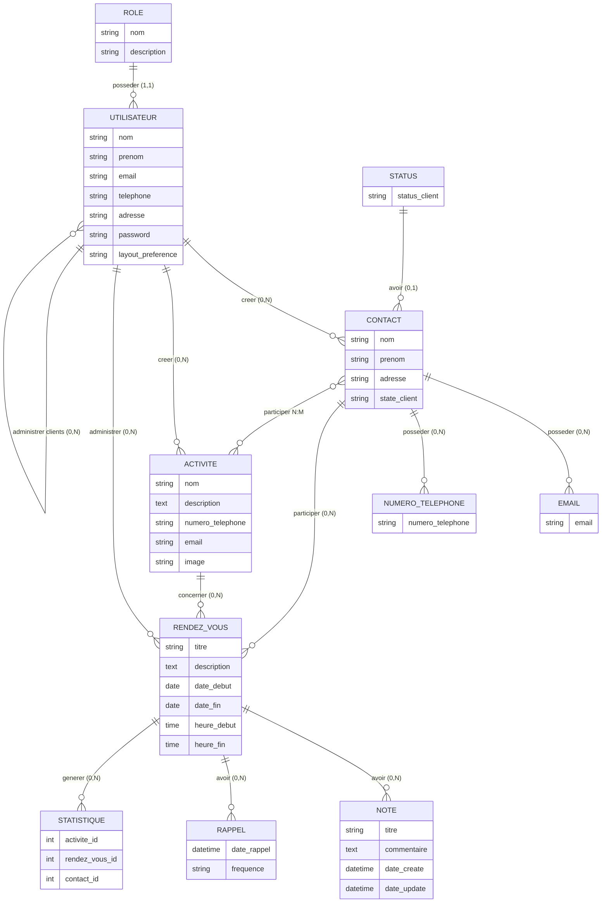
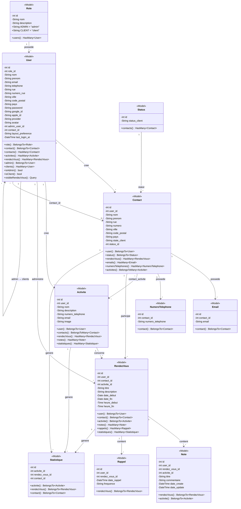

# Pro Contact — MCD, MLDR et Diagramme de Classe

**Projet:** Pro Contact
**Auteur:** Lung Sze Ho Eric
**Date:** Mars 2026
**Etablissement:** Ifosupwavre, Juin 2025
**Stack:** Laravel / PostgreSQL

---

## 1. MCD — Modele Conceptuel de Donnees

### 1.1 Diagramme Entite-Association (Mermaid)



### 1.2 Entites et Cardinalites

| Association | Entite A | Cardinalite | Entite B | Cardinalite | Description |
|-------------|----------|:-----------:|----------|:-----------:|-------------|
| posseder | ROLE | 1,N | UTILISATEUR | 1,1 | Un utilisateur possede un seul role |
| creer (contacts) | UTILISATEUR | 1,1 | CONTACT | 0,N | Un utilisateur cree 0 a N contacts |
| creer (activites) | UTILISATEUR | 1,1 | ACTIVITE | 0,N | Un utilisateur cree 0 a N activites |
| administrer (rdv) | UTILISATEUR | 1,1 | RENDEZ-VOUS | 0,N | Un utilisateur administre 0 a N rdv |
| administrer (clients) | UTILISATEUR (admin) | 0,N | UTILISATEUR (client) | 0,1 | Un admin gere 0 a N clients |
| avoir (status) | STATUS | 0,N | CONTACT | 0,1 | Un contact peut avoir un statut |
| posseder (emails) | CONTACT | 1,1 | EMAIL | 0,N | Un contact a 0 a N emails |
| posseder (tel) | CONTACT | 1,1 | NUMERO_TEL | 0,N | Un contact a 0 a N telephones |
| participer | CONTACT | 0,N | RENDEZ-VOUS | 1,1 | Un rdv concerne un contact |
| concerner | ACTIVITE | 0,N | RENDEZ-VOUS | 1,1 | Un rdv concerne une activite |
| participer (pivot) | CONTACT | 0,N | ACTIVITE | 0,N | Relation N:M via contact_activite |
| avoir (notes) | RENDEZ-VOUS | 0,N | NOTE | 1,1 | Un rdv a 0 a N notes |
| avoir (rappels) | RENDEZ-VOUS | 0,N | RAPPEL | 1,1 | Un rdv a 0 a N rappels |

---

## 2. MLDR — Modele Logique de Donnees Relationnel

### 2.1 Schema Relationnel

```
ROLES (
    id          : INT           PK AUTO_INCREMENT,
    nom         : VARCHAR(255)  NOT NULL UNIQUE,
    description : VARCHAR(255)  NULL,
    created_at  : TIMESTAMP     NULL,
    updated_at  : TIMESTAMP     NULL
)

USERS (
    id                     : BIGINT UNSIGNED  PK AUTO_INCREMENT,
    #role_id               : BIGINT UNSIGNED  NOT NULL  FK → ROLES(id) ON DELETE RESTRICT,
    nom                    : VARCHAR(255)     NOT NULL,
    prenom                 : VARCHAR(255)     NOT NULL,
    email                  : VARCHAR(255)     NOT NULL UNIQUE,
    telephone              : VARCHAR(255)     NULL,
    rue                    : VARCHAR(255)     NULL,
    numero_rue             : VARCHAR(255)     NULL,
    ville                  : VARCHAR(255)     NULL,
    code_postal            : VARCHAR(255)     NULL,
    pays                   : VARCHAR(255)     NULL,
    email_verified_at      : TIMESTAMP        NULL,
    password               : VARCHAR(255)     NOT NULL,
    remember_token         : VARCHAR(100)     NULL,
    google_id              : VARCHAR(255)     NULL,
    apple_id               : VARCHAR(255)     NULL,
    provider               : VARCHAR(255)     NULL,
    avatar                 : VARCHAR(255)     NULL,
    #admin_user_id         : BIGINT UNSIGNED  NULL      FK → USERS(id) ON DELETE CASCADE,
    #contact_id            : BIGINT UNSIGNED  NULL      FK → CONTACTS(id) ON DELETE SET NULL,
    layout_preference      : VARCHAR(20)      NOT NULL  DEFAULT 'modern',
    last_login_at          : TIMESTAMP        NULL,
    password_reset_token   : VARCHAR(255)     NULL,
    password_reset_expires : TIMESTAMP        NULL,
    created_at             : TIMESTAMP        NULL,
    updated_at             : TIMESTAMP        NULL
)

STATUSES (
    id            : BIGINT UNSIGNED  PK AUTO_INCREMENT,
    status_client : VARCHAR(255)     NOT NULL,
    created_at    : TIMESTAMP        NULL,
    updated_at    : TIMESTAMP        NULL
)

CONTACTS (
    id           : BIGINT UNSIGNED  PK AUTO_INCREMENT,
    #user_id     : BIGINT UNSIGNED  NOT NULL  FK → USERS(id) ON DELETE CASCADE,
    nom          : VARCHAR(255)     NOT NULL,
    prenom       : VARCHAR(255)     NOT NULL,
    rue          : VARCHAR(255)     NULL,
    numero       : VARCHAR(255)     NULL,
    ville        : VARCHAR(255)     NULL,
    code_postal  : VARCHAR(255)     NULL,
    pays         : VARCHAR(255)     NULL,
    state_client : VARCHAR(255)     NULL,
    #status_id   : BIGINT UNSIGNED  NULL      FK → STATUSES(id) ON DELETE SET NULL,
    created_at   : TIMESTAMP        NULL,
    updated_at   : TIMESTAMP        NULL
)

ACTIVITES (
    id               : BIGINT UNSIGNED  PK AUTO_INCREMENT,
    #user_id         : BIGINT UNSIGNED  NOT NULL  FK → USERS(id) ON DELETE CASCADE,
    nom              : VARCHAR(255)     NOT NULL,
    description      : TEXT             NULL,
    numero_telephone : VARCHAR(255)     NULL,
    email            : VARCHAR(255)     NULL,
    image            : VARCHAR(255)     NULL,
    created_at       : TIMESTAMP        NULL,
    updated_at       : TIMESTAMP        NULL
)

RENDEZ_VOUS (
    id           : BIGINT UNSIGNED  PK AUTO_INCREMENT,
    #user_id     : BIGINT UNSIGNED  NOT NULL  FK → USERS(id) ON DELETE CASCADE,
    #contact_id  : BIGINT UNSIGNED  NOT NULL  FK → CONTACTS(id) ON DELETE CASCADE,
    #activite_id : BIGINT UNSIGNED  NOT NULL  FK → ACTIVITES(id) ON DELETE CASCADE,
    titre        : VARCHAR(255)     NOT NULL,
    description  : TEXT             NULL,
    date_debut   : DATE             NOT NULL,
    date_fin     : DATE             NOT NULL,
    heure_debut  : TIME             NOT NULL,
    heure_fin    : TIME             NOT NULL,
    created_at   : TIMESTAMP        NULL,
    updated_at   : TIMESTAMP        NULL
)

NOTES (
    id               : BIGINT UNSIGNED  PK AUTO_INCREMENT,
    #user_id         : BIGINT UNSIGNED  NOT NULL  FK → USERS(id) ON DELETE CASCADE,
    #rendez_vous_id  : BIGINT UNSIGNED  NOT NULL  FK → RENDEZ_VOUS(id) ON DELETE CASCADE,
    #activite_id     : BIGINT UNSIGNED  NULL      FK → ACTIVITES(id) ON DELETE SET NULL,
    titre            : VARCHAR(255)     NOT NULL,
    commentaire      : TEXT             NOT NULL,
    date_create      : DATETIME         NOT NULL,
    date_update      : DATETIME         NOT NULL,
    created_at       : TIMESTAMP        NULL,
    updated_at       : TIMESTAMP        NULL
)

RAPPELS (
    id              : BIGINT UNSIGNED  PK AUTO_INCREMENT,
    #user_id        : BIGINT UNSIGNED  NOT NULL  FK → USERS(id) ON DELETE CASCADE,
    #rendez_vous_id : BIGINT UNSIGNED  NOT NULL  FK → RENDEZ_VOUS(id) ON DELETE CASCADE,
    date_rappel     : DATETIME         NOT NULL,
    frequence       : VARCHAR(255)     NOT NULL,
    created_at      : TIMESTAMP        NULL,
    updated_at      : TIMESTAMP        NULL
)

EMAILS (
    id          : BIGINT UNSIGNED  PK AUTO_INCREMENT,
    #contact_id : BIGINT UNSIGNED  NOT NULL  FK → CONTACTS(id) ON DELETE CASCADE,
    email       : VARCHAR(255)     NOT NULL,
    created_at  : TIMESTAMP        NULL,
    updated_at  : TIMESTAMP        NULL
)

NUMERO_TELEPHONES (
    id               : BIGINT UNSIGNED  PK AUTO_INCREMENT,
    #contact_id      : BIGINT UNSIGNED  NOT NULL  FK → CONTACTS(id) ON DELETE CASCADE,
    numero_telephone : VARCHAR(255)     NOT NULL,
    created_at       : TIMESTAMP        NULL,
    updated_at       : TIMESTAMP        NULL
)

STATISTIQUES (
    id               : BIGINT UNSIGNED  PK AUTO_INCREMENT,
    #activite_id     : BIGINT UNSIGNED  NOT NULL  FK → ACTIVITES(id) ON DELETE CASCADE,
    #rendez_vous_id  : BIGINT UNSIGNED  NOT NULL  FK → RENDEZ_VOUS(id) ON DELETE CASCADE,
    #contact_id      : BIGINT UNSIGNED  NOT NULL  FK → CONTACTS(id) ON DELETE CASCADE,
    created_at       : TIMESTAMP        NULL,
    updated_at       : TIMESTAMP        NULL
)

CONTACT_ACTIVITE (
    id           : BIGINT UNSIGNED  PK AUTO_INCREMENT,
    #contact_id  : BIGINT UNSIGNED  NOT NULL  FK → CONTACTS(id) ON DELETE CASCADE,
    #activite_id : BIGINT UNSIGNED  NOT NULL  FK → ACTIVITES(id) ON DELETE CASCADE,
    created_at   : TIMESTAMP        NULL,
    updated_at   : TIMESTAMP        NULL,
    UNIQUE(contact_id, activite_id)
)
```

### 2.2 Notation

- `PK` = Cle primaire
- `FK` = Cle etrangere (prefixe `#`)
- `NOT NULL` = Obligatoire
- `NULL` = Facultatif
- `UNIQUE` = Valeur unique dans la table
- `CASCADE` = Suppression en cascade
- `SET NULL` = Mise a NULL en cas de suppression du parent
- `RESTRICT` = Suppression du parent interdite si enfant existe

### 2.3 Dependances Fonctionnelles

```
ROLES:
    id → nom, description

USERS:
    id → role_id, nom, prenom, email, telephone, adresse, password,
         admin_user_id, contact_id, layout_preference, ...
    email → id  (contrainte d'unicite)

CONTACTS:
    id → user_id, nom, prenom, adresse, state_client, status_id

ACTIVITES:
    id → user_id, nom, description, numero_telephone, email, image

RENDEZ_VOUS:
    id → user_id, contact_id, activite_id, titre, description,
         date_debut, date_fin, heure_debut, heure_fin

NOTES:
    id → user_id, rendez_vous_id, activite_id, titre, commentaire,
         date_create, date_update

RAPPELS:
    id → user_id, rendez_vous_id, date_rappel, frequence

EMAILS:
    id → contact_id, email

NUMERO_TELEPHONES:
    id → contact_id, numero_telephone

STATISTIQUES:
    id → activite_id, rendez_vous_id, contact_id

CONTACT_ACTIVITE:
    (contact_id, activite_id) → id  (contrainte d'unicite composee)
```

---

## 3. Diagramme de Classe

### 3.1 Diagramme UML (Mermaid)



### 3.2 Relations entre classes

| Classe Source | Type | Classe Cible | Multiplicite | Via |
|--------------|------|-------------|:------------:|-----|
| Role | 1 ↔ * | User | Un role, plusieurs utilisateurs | `role_id` |
| User | 1 ↔ * | Contact | Un user, plusieurs contacts | `user_id` |
| User | 1 ↔ * | Activite | Un user, plusieurs activites | `user_id` |
| User | 1 ↔ * | RendezVous | Un user, plusieurs rdv | `user_id` |
| User (admin) | 1 ↔ * | User (client) | Un admin, plusieurs clients | `admin_user_id` |
| User (client) | * ↔ 1 | Contact | Un client lie a un contact | `contact_id` |
| Status | 1 ↔ * | Contact | Un statut, plusieurs contacts | `status_id` |
| Contact | 1 ↔ * | Email | Un contact, plusieurs emails | `contact_id` |
| Contact | 1 ↔ * | NumeroTelephone | Un contact, plusieurs tels | `contact_id` |
| Contact | * ↔ * | Activite | N:M via pivot | `contact_activite` |
| Contact | 1 ↔ * | RendezVous | Un contact, plusieurs rdv | `contact_id` |
| Activite | 1 ↔ * | RendezVous | Une activite, plusieurs rdv | `activite_id` |
| RendezVous | 1 ↔ * | Note | Un rdv, plusieurs notes | `rendez_vous_id` |
| RendezVous | 1 ↔ * | Rappel | Un rdv, plusieurs rappels | `rendez_vous_id` |
| RendezVous | 1 ↔ * | Statistique | Un rdv, plusieurs stats | `rendez_vous_id` |
| Activite | 1 ↔ * | Statistique | Une activite, plusieurs stats | `activite_id` |
| Contact | 1 ↔ * | Statistique | Un contact, plusieurs stats | `contact_id` |

---

## 4. Resume des Tables

### 4.1 Tables metier (12)

| # | Table | Type | Cle primaire | Cles etrangeres |
|---|-------|------|:------------:|:---------------:|
| 1 | `roles` | Reference | `id` | — |
| 2 | `users` | Principale | `id` | `role_id`, `admin_user_id`, `contact_id` |
| 3 | `statuses` | Reference | `id` | — |
| 4 | `contacts` | Donnees | `id` | `user_id`, `status_id` |
| 5 | `activites` | Donnees | `id` | `user_id` |
| 6 | `rendez_vous` | Donnees | `id` | `user_id`, `contact_id`, `activite_id` |
| 7 | `notes` | Donnees | `id` | `user_id`, `rendez_vous_id`, `activite_id` |
| 8 | `rappels` | Donnees | `id` | `user_id`, `rendez_vous_id` |
| 9 | `emails` | Donnees | `id` | `contact_id` |
| 10 | `numero_telephones` | Donnees | `id` | `contact_id` |
| 11 | `statistiques` | Donnees | `id` | `activite_id`, `rendez_vous_id`, `contact_id` |
| 12 | `contact_activite` | Pivot (N:M) | `id` | `contact_id`, `activite_id` |

### 4.2 Tables techniques Laravel (6)

| # | Table | Usage |
|---|-------|-------|
| 1 | `sessions` | Gestion des sessions utilisateur |
| 2 | `cache` | Stockage du cache |
| 3 | `cache_locks` | Verrous du cache |
| 4 | `password_reset_tokens` | Jetons de reinitialisation |
| 5 | `jobs` | File d'attente des taches |
| 6 | `failed_jobs` | Taches echouees |

### 4.3 Regles de suppression en cascade

```
Suppression d'un UTILISATEUR (admin) →
    ├── Supprime tous ses CONTACTS →
    │       ├── Supprime tous les EMAILS du contact
    │       ├── Supprime tous les NUMERO_TELEPHONES du contact
    │       └── Supprime toutes les lignes CONTACT_ACTIVITE
    ├── Supprime toutes ses ACTIVITES
    ├── Supprime tous ses RENDEZ_VOUS →
    │       ├── Supprime toutes les NOTES du rdv
    │       ├── Supprime tous les RAPPELS du rdv
    │       └── Supprime toutes les STATISTIQUES du rdv
    └── Supprime tous ses CLIENTS (users avec admin_user_id)

Suppression d'un ROLE →
    └── INTERDIT si des utilisateurs ont ce role (RESTRICT)
```

---

*Date de generation: 2026-03-15*
*Base de donnees: PostgreSQL*
*Framework: Laravel 11*
