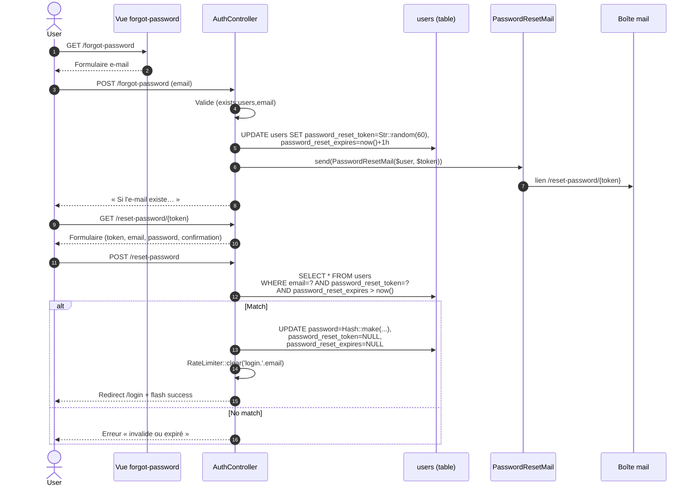

# Audit d'utilisation des tables

**Date :** 2026-04-26
**Branche :** `claude/audit-database-tables-aQnBK`

Vérification systématique : pour chaque table créée par les migrations, est-ce que le code applicatif la lit ou l'écrit réellement ?

## Méthode

Recherche dans `app/`, `routes/`, `database/seeders/`, `config/`, `.env.example` pour :

1. Le modèle Eloquent (PascalCase singulier) — `::create`, `::insert`, `::query`, `::find`, `::where`, `new ModelName`, `->save()`, `use App\Models\X`
2. Les requêtes directes : `DB::table('xxx')`
3. Les relations Eloquent pointant dessus : `belongsTo`, `hasMany`, `hasOne`, `belongsToMany`
4. Les opérations pivot : `attach`, `detach`, `sync`, `syncWithoutDetaching`
5. Pour les tables techniques Laravel : la configuration de driver actif (`config/cache.php`, `queue.php`, `session.php`)

## Résultats — 24 tables

### Tables métier (17)

| Table | Statut | Preuve |
|-------|--------|--------|
| `activites` | ✅ Active | `ActiviteController.php` `Activite::create`, `::where` ; `Livewire\StatisticsDashboard` |
| `client_portal_access_log` | ✅ Active | `Services\PortalAuthService` `ClientPortalAccessLog::create / ::where / ::delete` |
| `client_portal_otps` | ✅ Active | `Services\PortalAuthService` `ClientPortalOtp::create / ::where / ::delete` |
| `client_portal_tokens` | ✅ Active | `Services\PortalAuthService` `ClientPortalToken::create / ::where` |
| `client_portal_trusted_devices` | ✅ Active | `Services\PortalAuthService` `ClientPortalTrustedDevice::create / ::where / ::delete` |
| `contact_activite` | ✅ Active | `Models\Contact::activites()` belongsToMany ; `ActiviteController` `syncWithoutDetaching`, `detach` |
| `contacts` | ✅ Active | `ContactController` (CRUD complet) ; `Livewire\ContactManager` |
| `emails` | ✅ Active | Relation `Contact::emails()` HasMany ; `ContactService` create/delete |
| `note_templates` | ✅ Active | `PortalController` `NoteTemplate::where`, `::create` (PR #55) |
| `notes` | ✅ Active | `Livewire\NotesManager` `Note::create / ::where / ::findOrFail` |
| `numero_telephones` | ✅ Active | Relation `Contact::numeroTelephones()` ; `ContactService` |
| `rappels` | ✅ Active | `RappelController` `Rappel::create` ; `SendAppointmentEmail` job |
| `rendez_vous` | ✅ Active | `Livewire\AppointmentManager` `RendezVous::create / ::where` ; multiples controllers |
| `roles` | ✅ Active | `Auth\AuthController` `Role::where` ; `ClientManagementController` |
| `statuses` | ✅ Active | `Livewire\ContactManager` `Status::all()` ; relation Contact |
| `users` | ✅ Active | `Auth\AuthController` `User::create / ::where` ; partout |
| **`statistiques`** | 🟡 **Réservée** | Modèle importé dans `StatistiqueController` mais **jamais instancié à ce jour**. Les agrégats sont calculés à la volée par `selectRaw` sur les autres tables. **Conservée** comme support futur d'agrégats matérialisés (cache de stats, snapshots historiques) — schéma stable, prête à être alimentée. |

### Tables techniques Laravel (7)

| Table | Statut | Preuve |
|-------|--------|--------|
| `migrations` | ✅ Active | Gérée par `php artisan migrate` |
| `sessions` | ✅ Active | `config/session.php` driver=`database` ; `SESSION_DRIVER=database` |
| `cache` | ✅ Active | `config/cache.php` store=`database` ; `Cache::remember` dans `StatistiqueController`, `ContactManager` |
| `cache_locks` | ✅ Active | Table de verrous pour le store `database` |
| `jobs` | ✅ Active | `config/queue.php` driver=`database` ; `SendAppointmentEmail`, `PortalOtpMail` mis en file |
| `job_batches` | ✅ Active | Table de batches pour le queue driver `database` |
| `failed_jobs` | ✅ Active | Table d'échecs pour le queue driver `database` |
| **`password_reset_tokens`** | ⚠️ **Inerte** | Créée par défaut Laravel mais **jamais lue/écrite par ce projet**. `AuthController::initiatePasswordReset()` stocke le jeton sur `users.password_reset_token` + `users.password_reset_expires` ; `AuthController::resetPassword()` les relit. `Password::broker()` n'est jamais invoqué donc cette table reste vide. |

## Synthèse

| Catégorie | Nombre |
|-----------|:------:|
| Tables métier actives | 16 |
| Tables métier réservées (créées, schéma stable, non alimentées) | **1** (`statistiques`) |
| Tables techniques actives | 7 |
| Tables techniques inertes | **1** (`password_reset_tokens`) |
| **Total** | **25 créées · 23 alimentées · 2 réservées/inertes** |

## Recommandations

1. **`statistiques` — conserver** :
   - Le schéma est correct et reste prêt à être alimenté.
   - Cas d'usage envisagé : matérialisation d'agrégats historiques (snapshots de stats par mois), cache pré-calculé pour les dashboards lourds.
   - Aujourd'hui les chiffres sont calculés à la volée par `StatistiqueController` (suffisant tant que le volume de rendez-vous reste raisonnable).
   - Aucune action requise.

2. **`password_reset_tokens` — conserver telle quelle** (voir flux détaillé ci-dessous) :
   - Le projet a sa propre implémentation maison sur `users.password_reset_token` + `users.password_reset_expires` (migration `2025_07_19_001900_add_auth_fields_to_users_table`).
   - La table par défaut Laravel reste vide mais n'est pas gênante.
   - Si on voulait s'aligner sur la pratique standard, il faudrait basculer `forgotPassword()` / `resetPassword()` sur `Password::sendResetLink()` / `Password::reset()`. Pas urgent.

3. **Conserver tout le reste** — chaque autre table est référencée au moins une fois en lecture ou en écriture par le code applicatif.

---

## Annexe — Comment fonctionne le reset de mot de passe (custom)

> Pourquoi `password_reset_tokens` reste vide alors que la fonctionnalité marche ?

### Schéma : le jeton vit sur `users`, pas dans `password_reset_tokens`

Migration `2025_07_19_001900_add_auth_fields_to_users_table.php` ajoute deux colonnes sur `users` :

| Colonne | Type | Rôle |
|---------|------|------|
| `password_reset_token` | `VARCHAR(255)` nullable | Jeton aléatoire de 60 caractères (`Str::random(60)`) |
| `password_reset_expires` | `TIMESTAMP` nullable | Date d'expiration (création + 1h) |

### Routes (`routes/auth.php`)

```php
Route::get ('forgot-password',           [AuthController::class, 'showForgotPassword'])->name('password.request');
Route::post('forgot-password',           [AuthController::class, 'forgotPassword'])    ->name('password.email');
Route::get ('reset-password/{token}',    [AuthController::class, 'showResetPassword']) ->name('password.reset');
Route::post('reset-password',            [AuthController::class, 'resetPassword'])     ->name('password.update');
```

### Étape 1 — Demande de reset

`POST /forgot-password` → `AuthController::forgotPassword()` (ligne 198) :

1. Valide `email` (présent, format e-mail, **doit exister** dans `users`).
2. Récupère le `User`.
3. Appelle `initiatePasswordReset($user)` :
   - Génère `$token = Str::random(60)`.
   - `UPDATE users SET password_reset_token = $token, password_reset_expires = now() + 1h WHERE id = ?`.
   - Envoie `PasswordResetMail($user, $token)` (essais protégés par `try/catch`, log si échec).
4. Réponse : message générique « si l'e-mail existe vous recevrez un lien » (anti-énumération côté UI, mais la validation `exists:users,email` côté serveur trahit le contraire — point d'amélioration possible).

### Étape 2 — Affichage du formulaire de reset

`GET /reset-password/{token}` → `AuthController::showResetPassword($token)` (ligne 213) : retourne la vue `auth.reset-password` avec le jeton dans le formulaire.

### Étape 3 — Soumission du nouveau mot de passe

`POST /reset-password` → `AuthController::resetPassword()` (ligne 218) :

1. Valide : `token` présent, `email` valide, `password` ≥ 8 caractères et `confirmed`.
2. Cherche un `User` qui satisfait **les trois conditions à la fois** :
   ```php
   ->where('email', $request->email)
   ->where('password_reset_token', $request->token)
   ->where('password_reset_expires', '>', Carbon::now())
   ```
3. Si introuvable → erreur « invalide ou expiré ».
4. Sinon :
   - `password = Hash::make($request->password)`
   - `password_reset_token = NULL`
   - `password_reset_expires = NULL`
   - `RateLimiter::clear('login.' . $user->email)` (libère le throttle de login)
5. Redirige vers `/login` avec message de succès.

### Diagramme de séquence



### Pourquoi `password_reset_tokens` reste vide

| Côté Laravel (standard, table utilisée) | Côté ProContact (maison, table non utilisée) |
|-----------------------------------------|----------------------------------------------|
| `Password::sendResetLink(['email' => …])` | `AuthController::initiatePasswordReset()` |
| `Password::reset([...], fn($user, $pw) => …)` | `AuthController::resetPassword()` |
| Stockage : `password_reset_tokens` (PK = email, hash du token) | Stockage : `users.password_reset_token` + `users.password_reset_expires` |
| Mail : `Notification::send(new ResetPassword(...))` | `Mail::send(new PasswordResetMail($user, $token))` |
| Expiration : `config/auth.php → passwords.users.expire` (60 min par défaut) | En dur : `Carbon::now()->addHours(1)` |

> **Conséquence** : la table `password_reset_tokens` est créée par la migration par défaut Laravel (`0001_01_01_000000_create_users_table.php`) mais aucune ligne n'y entre. Le `config/auth.php` la cible toujours via `passwords.users.table`, mais cette config n'est lue que si on appelle la façade `Password::*`, ce qui n'arrive jamais dans ce projet.
