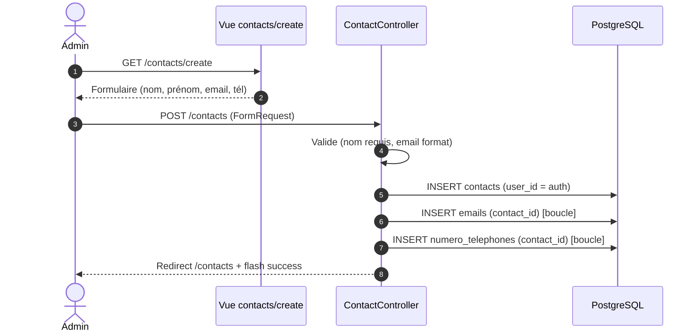
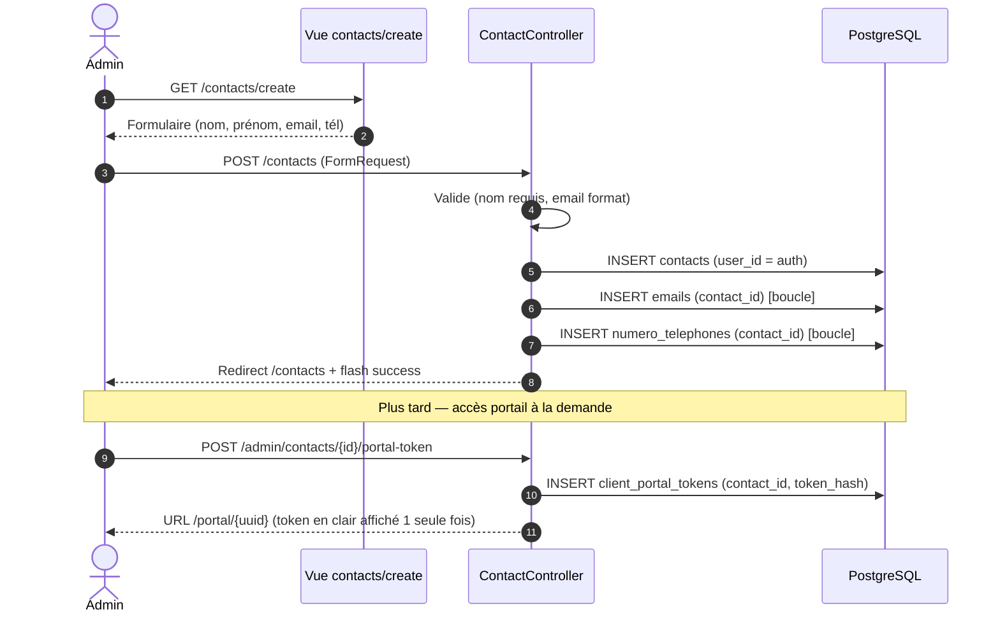

# UC1 — Créer un contact (Before / After)

**Acteur :** Utilisateur authentifié (admin ou client)
**Pré-condition :** session active
**Post-condition :** un contact appartenant à `auth()->id()` est persisté

---

## BEFORE

### Diagramme de séquence

### Données écrites

| Table | Lignes |
|-------|--------|
| `contacts` | 1 (user_id, nom, prénom, adresse) |
| `emails` | 0..N |
| `numero_telephones` | 0..N |

### Limites

- Email/téléphone obligatoirement attachés à un contact (pas de saisie isolée).
- Pas de modèle pré-rempli pour notes/contacts.
- Statut « Contact » par défaut, devient « Client » dès qu'un rendez-vous est créé (post-traitement).

---

## AFTER

### Ce qui change

Le flux de création de contact lui-même est **inchangé fonctionnellement**. Les évolutions touchent l'écosystème autour :

- Les **modèles de note** (`note_templates`) peuvent désormais cibler un contact spécifique pour pré-remplir les notes futures.
- Le **statut auto-promu** (Contact → Client) reste inchangé mais est désormais utilisé par le portail OTP pour autoriser l'accès.
- Le contact ne porte plus de `portal_token` en clair : un appel séparé `POST /admin/contacts/{id}/portal-token` génère un jeton hashé dans `client_portal_tokens`.

### Diagramme de séquence (mis à jour)

### Données écrites (delta)

| Table | Avant | Après |
|-------|:-----:|:-----:|
| `contacts` | 1 | 1 (sans `portal_token`) |
| `emails` | 0..N | 0..N |
| `numero_telephones` | 0..N | 0..N |
| `client_portal_tokens` | — | 0..N (sur action explicite) |
| `note_templates` | — | 0..N (sur action explicite, ciblage optionnel) |

### Tests Dusk

Voir `tests/Browser/UC1_ContactTest.php` — couvre :

1. Formulaire affiché
2. Création réussie + redirection
3. Validation (nom vide, email invalide)
4. Annulation = pas de persistance
