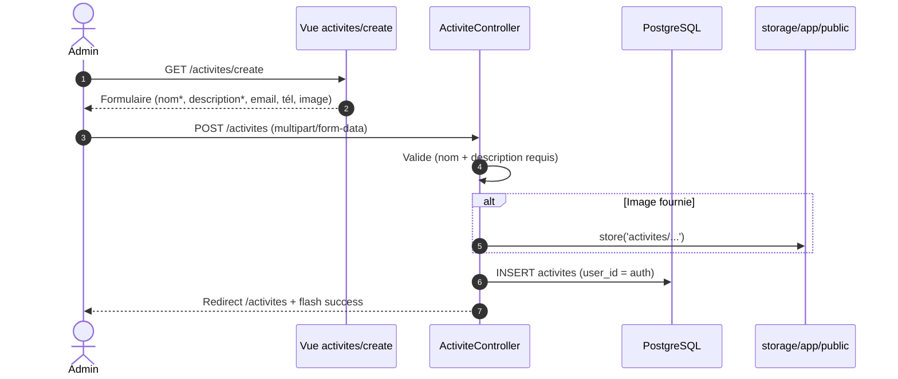
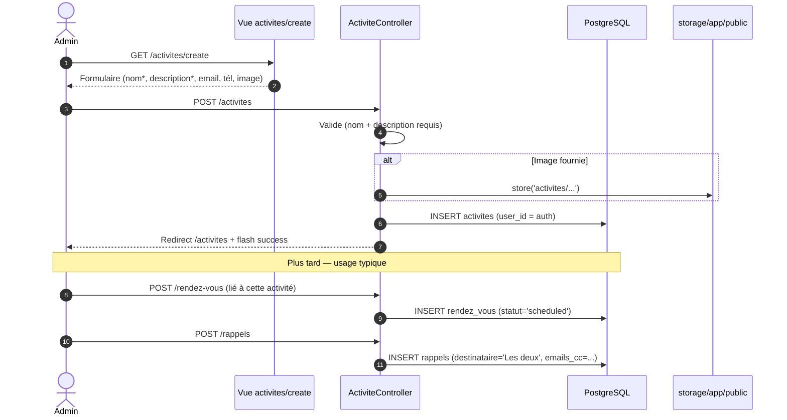

# UC2 — Créer une activité (Before / After)

**Acteur :** Utilisateur authentifié (admin)
**Pré-condition :** session active
**Post-condition :** une activité appartenant à `auth()->id()` est persistée et apparaît sous forme de carte

---

## BEFORE

### Diagramme de séquence

### Données écrites

| Table | Lignes |
|-------|--------|
| `activites` | 1 (user_id, nom, description, email, tél, image) |

### Limites

- Aucune statistique persistée — la table `statistiques` existe mais n'est jamais alimentée (les chiffres sont calculés à la volée).
- Aucun lien vers les modèles de note (n'existent pas).

---

## AFTER

### Ce qui change

Le flux de création d'activité est **inchangé fonctionnellement**. Les évolutions sont périphériques :

- La table morte `statistiques` est **supprimée** ; les agrégats sont confirmés comme calculés à la volée par `StatistiqueController` via `selectRaw`/`COUNT`.
- Les **rendez-vous** liés à une activité portent désormais un champ `statut` (`scheduled`, `done`, `cancelled`, …).
- Les **rappels** issus de ces rendez-vous gagnent `destinataire` (`'Le contact'` / `'Le créateur'` / `'Les deux'`) + une liste `emails_cc`.

### Diagramme de séquence (mis à jour)

### Données écrites (delta)

| Table | Avant | Après |
|-------|:-----:|:-----:|
| `activites` | 1 | 1 |
| `statistiques` | 0 (table inerte) | — *(table supprimée)* |
| `rendez_vous` (lié) | sans `statut` | + `statut` *(default `'scheduled'`)* |
| `rappels` (lié) | sans destinataire/CC | + `destinataire`, + `emails_cc` |

### Tests Dusk

Voir `tests/Browser/UC2_ActivityTest.php` — couvre :

1. Affichage en cartes
2. Création + visibilité immédiate sur le dashboard
3. Validation (nom + description requis)
4. Upload d'image optionnel
