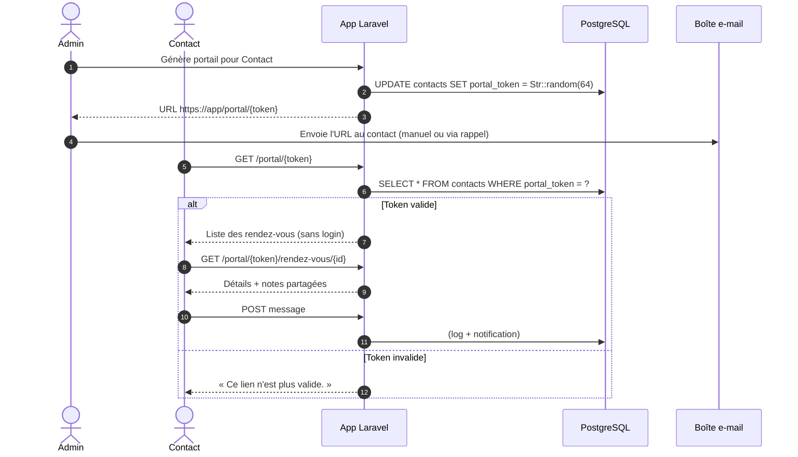
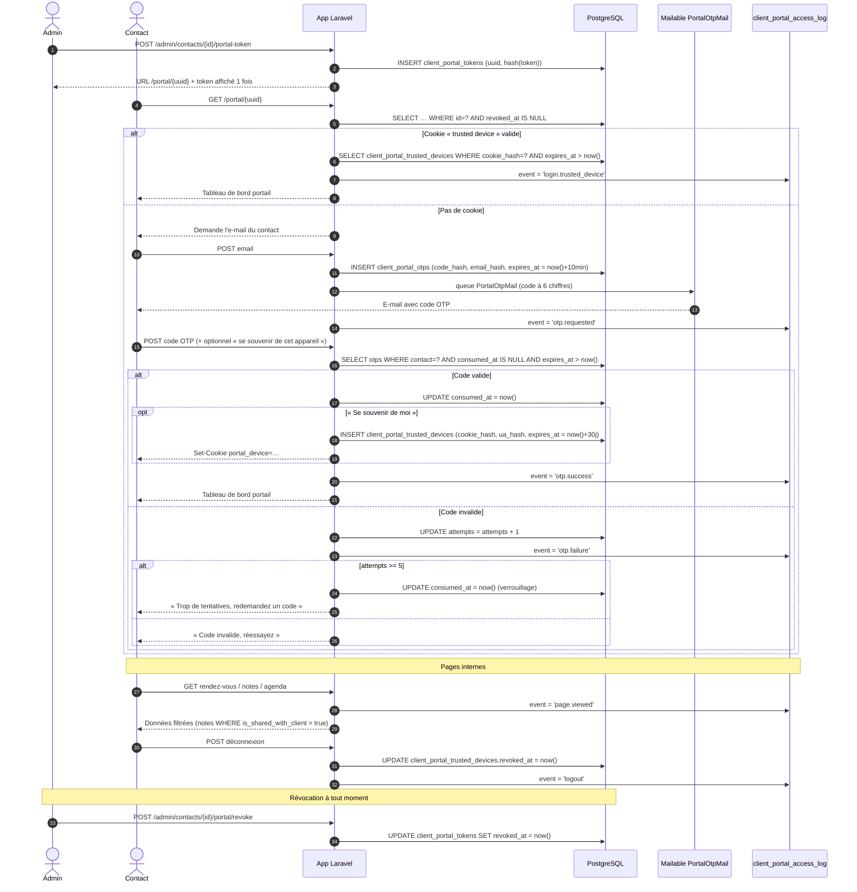
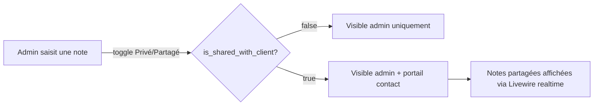

# UC3 — Portail client (Before / After)

**Acteur principal :** Contact (utilisateur non-authentifié dans l'app, propriétaire d'une adresse e-mail)
**Acteur secondaire :** Admin (génère / révoque les jetons)
**Pré-condition :** le contact possède au moins un e-mail enregistré
**Post-condition :** le contact accède à ses rendez-vous et notes partagées

---

## BEFORE — Magic-link permanent

### Diagramme de séquence

### Données impliquées

| Table | Usage |
|-------|-------|
| `contacts.portal_token` | Jeton permanent en clair, unique |
| `notes.is_shared_with_client` | Drapeau de visibilité (existait déjà mais non exposé en UI) |

### Limites / risques

- **Jeton en clair en base** → fuite de données = compromission de tous les portails actifs.
- **Pas d'expiration** → un lien partagé reste valide à vie.
- **Pas de second facteur** → quiconque a le lien accède aux rendez-vous.
- **Pas de journal d'accès** → impossible d'auditer qui a consulté quoi.
- **Pas de révocation fine** → il faut régénérer un nouveau jeton et propager l'URL.
- **Non conforme RGPD** sur le principe de minimisation et l'auditabilité.

---

## AFTER — Authentification OTP + appareil de confiance

### Diagramme de séquence

### Données écrites par accès

| Table | Lignes |
|-------|--------|
| `client_portal_tokens` | 1 (création par l'admin) |
| `client_portal_otps` | 1 par demande de code (réutilise les indexes `(contact_id, expires_at)`) |
| `client_portal_trusted_devices` | 0 ou 1 (sur opt-in du contact) |
| `client_portal_access_log` | N (un log par événement clé) |

### Garanties

| Propriété | Mécanisme |
|-----------|-----------|
| Aucun secret stocké en clair | `token_hash`, `code_hash`, `cookie_hash` (SHA-256) ; `email_hash` pour le rate-limit anonyme |
| Expiration | OTP = 10 min, trusted-device = 30 j, jeton portail = révocable explicitement |
| Anti-bruteforce | `attempts` plafonné à 5 par OTP + verrouillage par consommation forcée |
| Auditabilité | `client_portal_access_log` (event + ip + ua_hash + metadata JSON), purgé quotidiennement (rétention configurable) |
| Révocation | Admin : `revoked_at` sur le jeton. Contact : suppression de l'appareil de confiance |
| RGPD | Logs minimisés (hashes), purgeables, e-mail jamais stocké en clair côté OTP |

### Visibilité des notes (côté admin → portail)

### Évolution UX

| Étape | BEFORE | AFTER |
|-------|--------|-------|
| Distribution du lien | Manuelle (admin envoie l'URL) | Idem, mais l'URL ne donne plus accès directement |
| Accès initial | Lien magique → tableau de bord | Lien magique → e-mail OTP → tableau de bord |
| Accès récurrent | Réutilisation du même lien à vie | Cookie « trusted device » 30 j (sans réauth) |
| Notes partagées | Liste statique au chargement | Panneau **realtime** Livewire (poll) avec partage admin-only via toggle |
| Modèles de note | — | Admin peut créer des `note_templates` réutilisables |
| Révocation | Régénérer le `portal_token` | `revoked_at` sur le jeton + suppression des cookies trusted |
| Journal | — | `client_portal_access_log` (événements + IP + UA hashé) |

### Tests Dusk

Voir `tests/Browser/UC3_ClientPortalTest.php` — à étendre pour couvrir :

1. Demande d'OTP → réception par mail
2. Saisie OTP correct → accès au tableau de bord
3. Saisie OTP incorrect (5×) → verrouillage
4. Cookie trusted-device → bypass de l'OTP
5. Révocation admin → l'URL ne fonctionne plus
6. Notes privées **non** visibles côté portail
